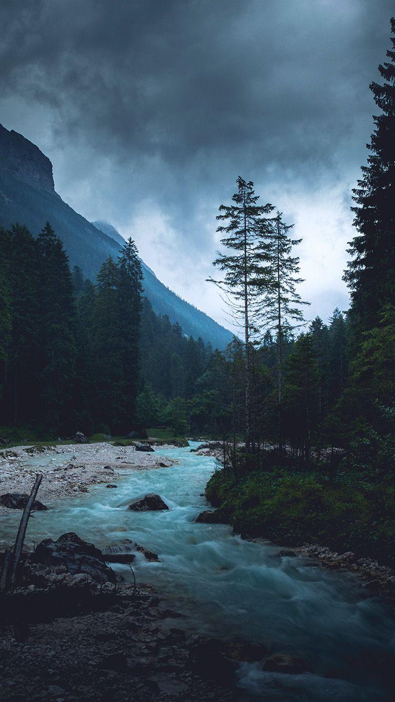

# Heading 1
## Heading 2
### Heading 3
#### Heading 4
##### Heading 5

---
# Fonts  
*Italic*
**Bold**

---
### Ordered lists
1. first
2. second 
3. third
### Fragmented
1) first
2) second 
3) third

- - -
### Unordered lists
- something fun
- wordy sentence
- wof wof
### Fragmented
* something fun
* wordy sentence
* wof wof
---
# Code (always fun 😄)
```
trait ScalaSentence {
    def ? : ScalaSentence = this
    def because : ScalaSentence = this
    def it : ScalaSentence = this
    def is : ScalaSentence = this
    def magic() : Unit = println("Yummy")
}
object WhyScala extends ScalaSentence
WhyScala.?.because.it.is.magic()
```
---
# Links
[A good book](https://springframework.guru/gang-of-four-design-patterns/)

---

# Table
| Syntax      | Description | Test Text     |
| :---        |    :----:   |          ---: |
| Header      | Title       | Here's this   |
| Paragraph   | Text        | And more      |

[Markdown table examples](https://www.markdownguide.org/extended-syntax/)

---
# Citations
> Sometimes it is the people no one can imagine anything of who do the things no one can imagine.
- Alan Turing
---
# Basic images


---
# Basic filters
| | | | |
| - | - | - | - |
|  |  |  |  |
|  |  |  |  |
|  |  |  |  |

---
# Marpit directive
## Fit entirly<!-- fit -->

---
<!-- class : invert -->
# Change class : 😁
---
<!-- 
footer: 'Change footer here'
class: normal
-->
# Multiple changes :D

---
<!-- class : invert -->
# Change background


---

# More
# Option


---
<!-- 
class : normal 
footer: 'Gianluca Aguzzi 2021'
-->

# And more


---


# Left aling

---


#### Right with multiple images aling
---
# Maths is always good

Render inline math such as $ax^2+bc+c$.

$$ I_{xx}=\int\int_Ry^2f(x,y)\cdot{}dydx $$

$$
f(x) = \int_{-\infty}^\infty
    \hat f(\xi)\,e^{2 \pi i \xi x}
    \,d\xi
$$
---
<style scoped>
h1 {
  color: blue;
}
</style>

# Some css :))

## Enjoy :smile: